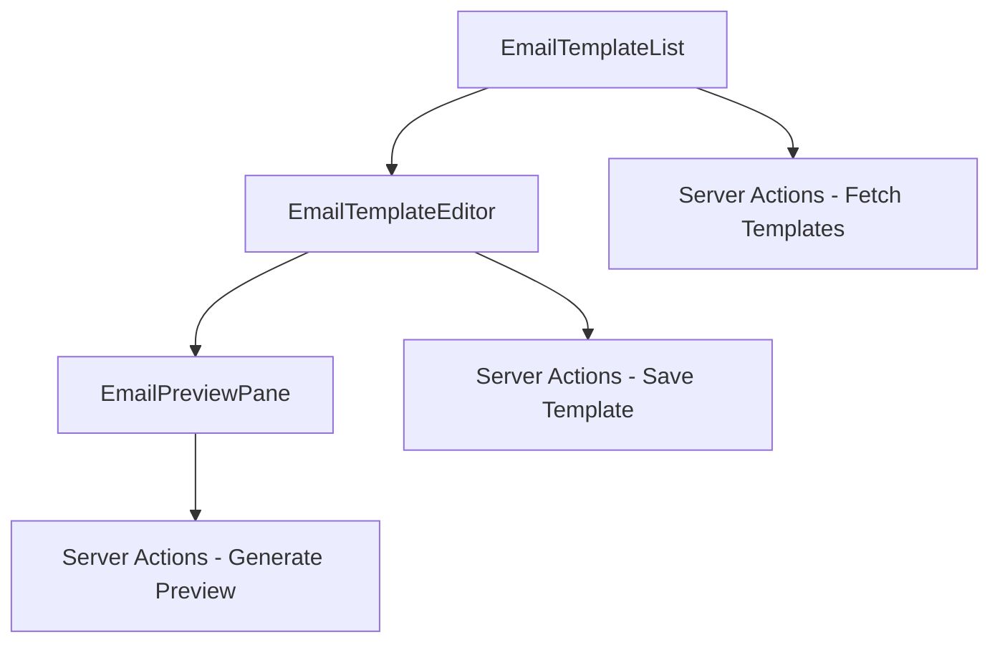

# Email Previewer Application Brownfield Enhancement Architecture

## Introduction

This document outlines the architectural approach for enhancing Email Previewer Application with a new feature. Its primary goal is to serve as the guiding architectural blueprint for AI-driven development of new features while ensuring seamless integration with the existing system.

**Relationship to Existing Architecture:**
This document supplements existing project architecture by defining how new components will integrate with current systems. Where conflicts arise between new and existing patterns, this document provides guidance on maintaining consistency while implementing enhancements.

### Existing Project Analysis

Based on my analysis of your project, I've identified the following about your existing system:

- **Primary Purpose:** A Next.js 15 application with React 19, TypeScript, TailwindCSS, Radix UI, Framer Motion, and TailwindCSS Animate for frontend. Backend uses PostgreSQL with Drizzle ORM, Server Actions, and Zustand. Authentication is handled by Better Auth with social providers. Stripe is integrated for payments, Fumadocs for documentation, MDX for blog, internationalization with next-intl, React Email for emails, and Resend for email delivery.
- **Current Tech Stack:** Next.js 15, React 19, TypeScript, TailwindCSS, Radix UI, Framer Motion, TailwindCSS Animate, PostgreSQL, Drizzle ORM, Better Auth, Stripe, Fumadocs, MDX, next-intl, React Email, Resend.
- **Architecture Style:** Server-first architecture leveraging Next.js App Router capabilities, component-driven development, server actions for API endpoints, type-safe development with TypeScript, internationalization-first approach, and feature module organization.
- **Deployment Method:** Cloudflare Workers compatible, Docker support, environment-based configuration.

Please confirm these observations are accurate before I proceed with architectural recommendations.

### Available Documentation

- Project README.md
- QWEN.md (MkSaaS Template - BMAD Method Documentation)
- package.json (lists dependencies)
- next.config.ts (Next.js configuration)
- tsconfig.json (TypeScript configuration)
- tailwind.config.ts (TailwindCSS configuration)
- drizzle.config.ts (Database configuration)
- biome.json (Code formatting and linting configuration)

### Identified Constraints

- Must maintain compatibility with existing Next.js 15 and React 19 setup.
- Must integrate with existing Drizzle ORM and PostgreSQL database.
- Must work within the existing authentication system (Better Auth).
- Must adhere to the existing internationalization setup (next-intl).
- Must follow the established directory structure and coding conventions.

## Enhancement Scope and Integration Strategy

Based on my analysis, the integration approach I'm proposing takes into account the existing Next.js 15, React 19, TypeScript, TailwindCSS, Radix UI, Framer Motion, and TailwindCSS Animate frontend stack, along with the PostgreSQL, Drizzle ORM, Better Auth, Stripe, Fumadocs, MDX, next-intl, React Email, and Resend backend stack. These integration points and boundaries respect your current architecture patterns.

### Enhancement Overview

**Enhancement Type:** New Feature
**Scope:** Adding email previewing capabilities to the application.
**Integration Impact:** Medium

### Integration Approach

**Code Integration Strategy:** New components will be created following the existing component-driven development approach. Server Actions will be used for data mutations. Existing utility functions and lib code will be leveraged where possible.
**Database Integration:** New tables may be required for storing email templates or preview configurations. These will be added using Drizzle ORM migrations.
**API Integration:** New Server Actions will be created for handling email preview requests. Existing API patterns will be followed.
**UI Integration:** New UI components will be created using Radix UI primitives and TailwindCSS, ensuring accessibility and consistency with the existing design.

### Compatibility Requirements

- **Existing API Compatibility:** New Server Actions will be designed to not conflict with existing ones.
- **Database Schema Compatibility:** New tables and columns will be added in a backward-compatible manner.
- **UI/UX Consistency:** New UI components will follow the existing design system and internationalization patterns.
- **Performance Impact:** The new feature will be optimized to minimize impact on existing application performance.

## Tech Stack Alignment

### Existing Technology Stack

| Category | Current Technology | Version | Usage in Enhancement | Notes |
| :--- | :--- | :--- | :--- | :--- |
| Frontend Framework | Next.js | 15 | Core framework for the application | Must be maintained |
| Frontend Library | React | 19 | Core library for UI components | Must be maintained |
| Language | TypeScript | Latest | Type safety across the stack | Must be maintained |
| Styling | TailwindCSS | Latest | Utility-first CSS framework | Must be maintained |
| UI Components | Radix UI | Latest | Accessible UI primitives | Must be maintained |
| Animations | Framer Motion | Latest | For animations | Must be maintained |
| Animations | TailwindCSS Animate | Latest | For animations | Must be maintained |
| Database | PostgreSQL | Latest | Primary database | Must be maintained |
| ORM | Drizzle ORM | Latest | Database access | Must be maintained |
| Authentication | Better Auth | Latest | User authentication | Must be maintained |
| Payments | Stripe | Latest | Subscription and one-time payments | Must be maintained |
| Documentation | Fumadocs | Latest | Documentation | Must be maintained |
| Content | MDX | Latest | Blog and content | Must be maintained |
| Internationalization | next-intl | Latest | i18n support | Must be maintained |
| Email Templates | React Email | Latest | Responsive email templates | Must be maintained |
| Email Delivery | Resend | Latest | Email delivery | Must be maintained |

### New Technology Additions

No new technologies are required for this enhancement.

## Data Models and Schema Changes

### New Data Models

**Model Name:** EmailTemplate
**Purpose:** To store email templates for previewing.
**Integration:** Will be integrated with existing user and content management systems.
**Key Attributes:**
- id: string - Unique identifier for the template.
- name: string - Name of the template.
- content: string - The HTML content of the email template.
- userId: string - Foreign key to the user who created the template.
- createdAt: timestamp - When the template was created.
- updatedAt: timestamp - When the template was last updated.

**Relationships:**
- **With Existing:** Belongs to a user (via userId).
- **With New:** None.

**Model Name:** EmailPreview
**Purpose:** To store generated email previews.
**Integration:** Will be linked to EmailTemplate and User.
**Key Attributes:**
- id: string - Unique identifier for the preview.
- templateId: string - Foreign key to the email template.
- html: string - The generated HTML preview.
- createdAt: timestamp - When the preview was generated.

**Relationships:**
- **With Existing:** Belongs to an EmailTemplate (via templateId).
- **With New:** None.

### Schema Integration Strategy

**Database Changes Required:**
- **New Tables:** EmailTemplate, EmailPreview
- **Modified Tables:** None
- **New Indexes:** Indexes on userId in EmailTemplate and templateId in EmailPreview
- **Migration Strategy:** Create new migrations using `pnpm db:generate` and apply with `pnpm db:migrate`.

**Backward Compatibility:**
- New tables do not affect existing schema.
- Existing data remains unaffected.

## Component Architecture

The new components I'm proposing follow the existing architectural patterns I identified in your codebase: component-driven development, server-first architecture, type-safe development, internationalization-first approach, and feature module organization. The integration interfaces respect your current component structure and communication patterns.

### New Components

**Component Name:** EmailTemplateEditor
**Responsibility:** Allows users to create and edit email templates.
**Integration Points:** Integrates with the database via Server Actions for saving templates. Uses Radix UI and TailwindCSS for the UI.
**Key Interfaces:**
- onSaveTemplate(templateData)
- onPreviewTemplate(templateData)
**Dependencies:**
- **Existing Components:** None directly, but uses existing UI primitives.
- **New Components:** EmailPreviewPane
**Technology Stack:** React, TypeScript, TailwindCSS, Radix UI

**Component Name:** EmailPreviewPane
**Responsibility:** Displays a live preview of the email template.
**Integration Points:** Receives template data as props. Renders the HTML preview.
**Key Interfaces:**
- template: EmailTemplate
**Dependencies:**
- **Existing Components:** None
- **New Components:** None
**Technology Stack:** React, TypeScript, TailwindCSS

**Component Name:** EmailTemplateList
**Responsibility:** Lists all email templates for the user.
**Integration Points:** Fetches templates from the database via Server Actions. Links to the editor for each template.
**Key Interfaces:**
- onEditTemplate(templateId)
- onDeleteTemplate(templateId)
**Dependencies:**
- **Existing Components:** None directly, but uses existing UI primitives.
- **New Components:** None
**Technology Stack:** React, TypeScript, TailwindCSS, Radix UI

### Component Interaction Diagram



## Source Tree Integration

### Existing Project Structure

```
├── content/
├── messages/
├── src/
│   ├── actions/
│   ├── app/
│   ├── components/
│   ├── config/
│   ├── credits/
│   ├── db/
│   ├── hooks/
│   ├── i18n/
│   ├── lib/
│   ├── mail/
│   ├── payment/
│   ├── stores/
│   └── styles/
├── public/
```

### New File Organization

```
{{project-root}}/
├── src/
│   ├── actions/
│   │   └── email-actions.ts        # New file for email-related Server Actions
│   ├── app/
│   │   └── email/                  # New directory for email previewing routes
│   │       ├── page.tsx
│   │       └── components/
│   │           ├── EmailTemplateEditor.tsx
│   │           ├── EmailPreviewPane.tsx
│   │           └── EmailTemplateList.tsx
│   ├── components/
│   │   └── email/                  # New directory for reusable email components
│   │       ├── EmailEditor.tsx
│   │       └── EmailPreview.tsx
│   ├── db/
│   │   └── schema/                 # Update schema files for new tables
│   │       ├── email-templates.ts
│   │       └── email-previews.ts
│   └── mail/
│       └── templates/              # New directory for email templates if needed
├── content/                        # Existing directory
├── messages/                       # Existing directory
└── public/                         # Existing directory
```

### Integration Guidelines

- **File Naming:** Follow existing conventions (e.g., PascalCase for components, kebab-case for files).
- **Folder Organization:** Group related functionality into feature-specific directories.
- **Import/Export Patterns:** Use existing patterns for importing and exporting modules.

## Infrastructure and Deployment Integration

### Existing Infrastructure

**Current Deployment:** Cloudflare Workers compatible, Docker support, environment-based configuration.
**Infrastructure Tools:** Docker, Cloudflare Workers, pnpm.
**Environments:** Development, Production.

### Enhancement Deployment Strategy

**Deployment Approach:** Deploy as part of the existing Next.js application.
**Infrastructure Changes:** None required.
**Pipeline Integration:** Existing deployment pipeline will be used.

### Rollback Strategy

**Rollback Method:** Revert to the previous git commit and redeploy.
**Risk Mitigation:** Ensure database migrations are backward-compatible.
**Monitoring:** Use existing monitoring tools.

## Coding Standards and Conventions

### Existing Standards Compliance

**Code Style:** Follows the MkSaaS template conventions with TypeScript, TailwindCSS, and Radix UI.
**Linting Rules:** Biome for formatting and linting.
**Testing Patterns:** Not explicitly defined in the provided documentation, but should follow established patterns.
**Documentation Style:** Inline comments and README.md.

### Enhancement-Specific Standards

None required.

### Critical Integration Rules

- **Existing API Compatibility:** New Server Actions must not conflict with existing ones.
- **Database Integration:** New tables and columns must be added in a backward-compatible manner.
- **Error Handling:** Follow existing error handling patterns in Server Actions and components.
- **Logging Consistency:** Use existing logging mechanisms.

## Testing Strategy

### Integration with Existing Tests

**Existing Test Framework:** Not explicitly defined in the provided documentation.
**Test Organization:** Not explicitly defined in the provided documentation.
**Coverage Requirements:** Not explicitly defined in the provided documentation. Aim for comprehensive coverage of new features.

### New Testing Requirements

#### Unit Tests for New Components

- **Framework:** Jest or the existing test framework.
- **Location:** `src/app/email/components/__tests__/`
- **Coverage Target:** 80%+
- **Integration with Existing:** Follow existing test patterns.

#### Integration Tests

- **Scope:** Test the interaction between new components and Server Actions.
- **Existing System Verification:** Ensure existing functionality remains intact.
- **New Feature Testing:** Test the new email previewing feature thoroughly.

#### Regression Testing

- **Existing Feature Verification:** Run existing tests to ensure no regressions.
- **Automated Regression Suite:** Integrate new tests into the existing suite.
- **Manual Testing Requirements:** Perform manual testing of the new feature.

## Security Integration

### Existing Security Measures

**Authentication:** Better Auth for authentication with social providers.
**Authorization:** Not explicitly defined in the provided documentation.
**Data Protection:** Not explicitly defined in the provided documentation.
**Security Tools:** Not explicitly defined in the provided documentation.

### Enhancement Security Requirements

**New Security Measures:** Ensure email templates are sanitized before rendering previews.
**Integration Points:** The email previewing feature must integrate with the existing authentication system.
**Compliance Requirements:** Not explicitly defined in the provided documentation.

### Security Testing

**Existing Security Tests:** Not explicitly defined in the provided documentation.
**New Security Test Requirements:** Test for XSS vulnerabilities in email template previews.
**Penetration Testing:** Not explicitly defined in the provided documentation.

## Checklist Results Report

This section will be populated after executing the architect-checklist.

## Next Steps

### Story Manager Handoff

Create user stories for implementing the email previewing feature, referencing this architecture document. Key integration requirements include creating new Server Actions, database tables, and UI components. The first story should focus on setting up the basic email template editor and preview pane.

### Developer Handoff

Developers should start by creating the new database tables using Drizzle ORM. Then, implement the Server Actions for saving and retrieving email templates. Finally, build the UI components for the email template editor and preview pane, ensuring they integrate with the existing authentication and internationalization systems.