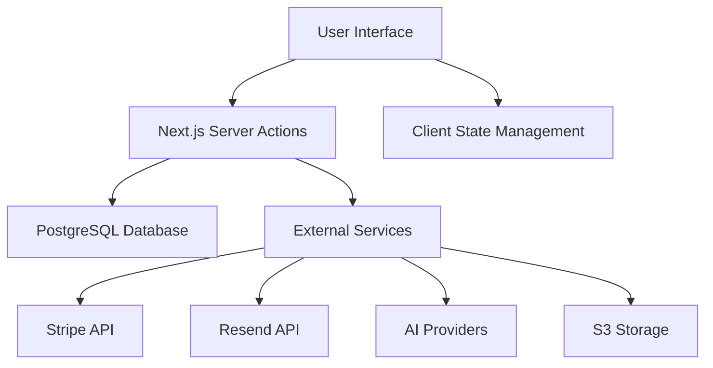

# Application Architecture Document

## Introduction

This document outlines the technical architecture for this SaaS application, a comprehensive Next.js system designed to provide essential SaaS features including authentication, payments, internationalization, newsletter management, dashboard, blog, documentation, and UI components.

### Purpose

This architecture document serves to:
1. Define the technical approach and structure of the application
2. Establish the system's components, interactions, and data flows
3. Document design decisions and architectural patterns
4. Provide guidance for developers extending or customizing the system
5. Ensure alignment with modern full-stack development best practices

### Scope

The application architecture encompasses:
- Full-stack Next.js 15 application with App Router
- Authentication system with social providers
- Payment integration with Stripe
- Internationalization support
- Content management system
- Email system with React Email
- AI features integration
- Analytics and monitoring
- Storage and file management
- Comprehensive UI component library

## System Overview

### Context & Positioning

This is a full-stack SaaS application built on Next.js 15 with App Router, designed to provide a production-ready foundation for SaaS products. It includes all essential components needed for a modern SaaS product, from authentication and payments to content management and analytics.

### Key Components

1. **Frontend UI**: React components with TypeScript, TailwindCSS, and Radix UI
2. **Backend Services**: Next.js Server Actions and API routes
3. **Database**: PostgreSQL with Drizzle ORM
4. **Authentication**: Better Auth with social providers
5. **Payments**: Stripe integration for subscriptions and one-time payments
6. **Content Management**: Fumadocs for documentation and MDX for blog content
7. **Email System**: React Email components with Resend integration
8. **AI Features**: Integration with multiple AI providers
9. **Analytics**: Multiple analytics provider support
10. **Storage**: S3 integration for file uploads

## Technology Stack

### Frontend Technologies

- **Framework**: Next.js 15 with App Router
- **Language**: TypeScript
- **UI Components**: Radix UI primitives
- **Styling**: TailwindCSS
- **State Management**: Zustand for client-side state
- **Animations**: Framer Motion
- **Internationalization**: next-intl
- **Forms**: react-hook-form with next-safe-action

### Backend Technologies

- **Framework**: Next.js 15 with App Router
- **Runtime**: Node.js
- **Database**: PostgreSQL with Drizzle ORM
- **Authentication**: Better Auth
- **Payments**: Stripe
- **Email Delivery**: Resend
- **API**: Next.js Server Actions and API routes
- **Validation**: Zod for runtime validation

### Infrastructure

- **Deployment**: Cloudflare Workers compatible
- **Database**: PostgreSQL
- **Storage**: S3-compatible storage
- **Monitoring**: OpenPanel analytics
- **Code Quality**: Biome for formatting and linting

## Architecture Patterns & Principles

### Architectural Style

The application follows a monolithic architecture pattern with server-first principles:
- Server-first architecture using Next.js Server Actions
- Component-driven development for UI elements
- Type-safe development across the entire stack
- Internationalization-first design
- Feature module organization

### Core Principles

1. **Component-Driven Development**: UI components built in isolation using Radix UI primitives and TailwindCSS
2. **Server-First Architecture**: Leveraging Next.js Server Actions and React Server Components
3. **Type Safety**: End-to-end type safety using TypeScript across the entire stack
4. **Internationalization-First**: All content internationalized by default using next-intl
5. **Feature Module Organization**: Related functionality grouped into feature modules
6. **Progressive Enhancement**: Core functionality works without JavaScript, enhanced when available

## System Design

### High-Level Architecture Diagram



### Data Flow

1. User interacts with the frontend UI
2. UI sends requests to Next.js Server Actions for data mutations
3. Server Actions process business logic and interact with the database or external services
4. Database stores/retrieves application data
5. External services handle payments, email delivery, AI processing, and storage
6. Client-side state management handles UI state that doesn't need to be shared

### Component Structure

#### Frontend Component Organization

The frontend components are organized by feature:
- **Admin Components**: Admin dashboard and user management
- **Auth Components**: Authentication flows and UI elements
- **Dashboard Components**: User dashboard elements
- **Docs Components**: Documentation UI elements
- **Layout Components**: Global layout elements (header, footer, etc.)
- **Pricing Components**: Pricing page elements
- **Settings Components**: User settings UI
- **Shared Components**: Reusable components across features
- **UI Components**: Low-level UI primitives and design system components

#### Backend Services Organization

Backend services are organized by feature:
- **Auth Actions**: Authentication-related Server Actions
- **Payment Actions**: Payment processing Server Actions
- **User Actions**: User management Server Actions
- **Content Actions**: Content management Server Actions
- **AI Actions**: AI feature Server Actions
- **Email Actions**: Email sending Server Actions

### Database Design

#### Schema Overview

The database schema consists of several core tables:
1. **User Table**: User accounts and profiles
2. **Session Table**: User sessions and authentication tokens
3. **Account Table**: User account connections to social providers
4. **Verification Table**: Email verification and password reset tokens
5. **Payment Table**: Payment records and subscription information
6. **User Credit Table**: User credit balances for pay-per-use features
7. **Credit Transaction Table**: Credit usage and purchase records

#### Relationships

- Users have one-to-many relationships with sessions, accounts, payments, and credit records
- Sessions are tied to specific users
- Accounts represent social provider connections for users
- Payments are associated with users and their subscription status
- User credits track available credits for pay-per-use features
- Credit transactions record all credit usage and purchases

#### Indexing Strategy

Tables are indexed for performance:
- User ID indexes on all related tables
- Email unique index on user table
- Payment status and type indexes
- Credit transaction type indexes

### API Design

#### Server Actions

Server Actions are used for all data mutations:
- Authentication actions (login, register, logout, password reset)
- User management actions (profile updates, settings changes)
- Payment actions (subscription management, one-time payments)
- Content actions (blog posts, documentation updates)
- Credit actions (credit purchases, usage tracking)

#### API Routes

Traditional API routes are used for specific integrations:
- Webhook endpoints for payment providers
- Analytics event tracking
- Sitemap and robots.txt generation

### Security Considerations

#### Authentication & Authorization

- Better Auth for authentication with social providers
- Cookie-based session management
- Role-based access control for admin features
- Email verification workflows
- Password reset flows

#### Data Protection

- Environment variables for sensitive configuration
- Database connection pooling
- Input validation with Zod
- SQL injection prevention through Drizzle ORM
- Proper error handling to avoid information leakage

#### API Security

- Rate limiting for API endpoints
- CSRF protection for forms
- Input sanitization for all user data
- Secure headers configuration
- Content Security Policy implementation

### Performance Considerations

#### Optimization Strategies

1. **Database Optimization**
   - Proper indexing strategy
   - Connection pooling
   - Query optimization

2. **Caching**
   - React Query for client-side caching
   - Server-side caching where appropriate
   - CDN for static assets

3. **Code Splitting**
   - Next.js automatic code splitting
   - Dynamic imports for heavy components
   - Bundle optimization

4. **Image Optimization**
   - Next.js Image component
   - Responsive image serving
   - Format optimization

#### Server-Side Rendering

- Static generation for static pages
- Server-side rendering for dynamic content
- Incremental Static Regeneration where appropriate
- Streaming for improved loading performance

### Scalability Considerations

#### Horizontal Scaling

- Stateless server actions allow for horizontal scaling
- Database connection pooling
- CDN for static assets
- Cloudflare Workers deployment support

#### Database Scaling

- Indexing strategy for query performance
- Connection pooling for efficient database usage
- Potential for read replicas

#### Future Enhancements

- Microservices architecture for high-scale deployments
- GraphQL API for complex data fetching
- Advanced caching strategies
- Geographic distribution

## Integration Points

### Authentication System

1. **Better Auth Integration**
   - PostgreSQL adapter for user storage
   - Social provider support (Google, GitHub)
   - Email/password authentication
   - Session management

2. **Admin Plugin**
   - User management interface
   - User banning capabilities
   - Role-based access control

### Payment System

1. **Stripe Integration**
   - Subscription management
   - One-time payments
   - Customer portal access
   - Webhook handling

2. **Credit System**
   - Credit purchase packages
   - Credit usage tracking
   - Pay-per-use feature support

### Content Management

1. **Fumadocs Integration**
   - Documentation system
   - MDX support for rich content
   - Search functionality

2. **Blog System**
   - MDX-based blog posts
   - Category organization
   - Pagination support

### Email System

1. **Resend Integration**
   - Email delivery
   - React Email templates
   - Newsletter subscription

2. **Email Templates**
   - Component-based email design
   - Internationalization support
   - Preview development server

### AI Features

1. **Multiple Provider Support**
   - OpenAI integration
   - Replicate integration
   - Google AI integration
   - Fireworks AI integration

2. **Image Generation**
   - Provider-agnostic implementation
   - Result storage and retrieval
   - Usage tracking

### Analytics

1. **Multiple Provider Support**
   - OpenPanel integration
   - Vercel Analytics
   - Custom event tracking

2. **Performance Monitoring**
   - Web Vitals tracking
   - Custom metric collection
   - User behavior analysis

### Storage

1. **S3 Integration**
   - File upload handling
   - URL generation
   - Access control

## Deployment & Operations

### Deployment Architecture

- Cloudflare Workers compatible deployment
- Docker support for containerized deployment
- Environment-based configuration
- Zero-downtime deployment support

### Monitoring & Logging

- OpenPanel analytics for user behavior
- Vercel Analytics for performance
- Error tracking and reporting
- Custom event logging

### Backup & Recovery

- Database backup strategies
- Content versioning
- Disaster recovery procedures

## Testing Strategy

### Unit Testing

- Component testing with React Testing Library
- Server Action testing with various input scenarios
- Utility function testing
- Database query testing

### Integration Testing

- End-to-end workflow testing
- Authentication flow testing
- Payment integration testing
- Email delivery testing

### Performance Testing

- Page load performance testing
- Database query performance testing
- API response time testing
- Stress testing for high-load scenarios

### Quality Assurance

- Biome for code formatting and linting
- TypeScript for type safety
- Knip for dependency analysis
- Accessibility testing

## Development Workflow

### Feature Development

1. **Database Changes**
   - Schema updates in `src/db/schema.ts`
   - Migration generation with `pnpm db:generate`
   - Migration application with `pnpm db:migrate`

2. **Server Actions**
   - Implementation in `src/actions/`
   - Validation with next-safe-action
   - Testing with unit tests

3. **UI Components**
   - Implementation in `src/components/`
   - TypeScript interfaces for props
   - Storybook stories where applicable

4. **Content Management**
   - MDX content in `content/` directory
   - Processing with `pnpm content` command

### Code Quality

1. **Formatting**
   - Biome formatting with `pnpm format`
   - Automatic formatting on save

2. **Linting**
   - Biome linting with `pnpm lint`
   - Error prevention rules

3. **Type Safety**
   - TypeScript for all code
   - Strict type checking
   - Zod for runtime validation

### Content Management

1. **Documentation**
   - Fumadocs processing
   - MDX content management
   - Search index generation

2. **Blog**
   - MDX blog posts
   - Category organization
   - RSS feed generation

## Directory Structure

### Core Directories

```
├── content/              # MDX content for docs and blog
├── messages/             # Translation files (en.json, zh.json)
├── src/
│   ├── actions/          # Server actions for API operations
│   ├── ai/               # AI feature implementations
│   ├── analytics/        # Analytics integration
│   ├── app/              # Next.js app router with internationalized routing
│   ├── assets/           # Static assets
│   ├── components/       # Reusable React components organized by feature
│   ├── config/           # Application configuration files
│   ├── credits/          # Credit system implementation
│   ├── db/               # Database schema and migrations
│   ├── hooks/            # Custom React hooks
│   ├── i18n/             # Internationalization setup
│   ├── lib/              # Utility functions and shared code
│   ├── mail/             # Email templates and mail functionality
│   ├── newsletter/       # Newsletter subscription system
│   ├── notification/     # Notification system
│   ├── payment/          # Stripe payment integration
│   ├── storage/          # Storage integration
│   ├── stores/           # Zustand state management
│   ├── styles/           # Global styles and Tailwind configuration
│   ├── types/            # TypeScript type definitions
│   ├── middleware.ts     # Next.js middleware
│   └── routes.ts         # Route configuration
├── public/               # Static assets served directly
```

### Feature Module Organization

Each feature is organized in its own directory with a consistent structure:
- Components in `src/components/{feature}/`
- Server Actions in `src/actions/{feature}.ts`
- Utility functions in `src/lib/{feature}/`
- Configuration in `src/config/{feature}.ts`
- Types in `src/types/{feature}.ts`

## Configuration

### Environment Variables

Environment variables are managed through:
- `.env` files for local development
- Platform-specific configuration for deployment
- Type-safe access through configuration utilities

### Application Configuration

Main configuration is in `src/config/website.tsx`:
- Site metadata and branding
- Feature flags
- Provider configuration
- Internationalization settings

### Database Configuration

Database configuration in `drizzle.config.ts`:
- Connection settings
- Migration directory
- Schema file location

### UI Configuration

TailwindCSS configuration in `tailwind.config.ts`:
- Design system tokens
- Component variants
- Plugin configuration

## Risks & Mitigations

### Technical Risks

1. **Database Performance**
   - Risk: Query performance degradation with scale
   - Mitigation: Proper indexing and connection pooling

2. **Third-Party Dependencies**
   - Risk: Service outages or API changes
   - Mitigation: Graceful degradation and monitoring

3. **Security Vulnerabilities**
   - Risk: Authentication bypass or data breaches
   - Mitigation: Regular security audits and updates

### Operational Risks

1. **Deployment Complexity**
   - Risk: Complex deployment process
   - Mitigation: Automated deployment scripts and documentation

2. **Scaling Challenges**
   - Risk: Performance issues with user growth
   - Mitigation: Horizontal scaling architecture

3. **Maintenance Overhead**
   - Risk: Dependency updates and security patches
   - Mitigation: Automated dependency management

## Conclusion

The application architecture provides a solid foundation for building modern SaaS applications with Next.js. By following established patterns and best practices, it offers a production-ready system that can be extended and customized to meet specific business requirements.

The architecture emphasizes security, performance, and maintainability while providing a comprehensive set of features essential for SaaS applications. The modular approach ensures that features can be developed, tested, and deployed independently, reducing risk and allowing for iterative improvements.

## Change Log

| Date | Version | Description | Author |
| :--- | :--- | :--- | :--- |
| 2025-09-15 | 1.0 | Initial application architecture document | Architect (Winston) |

## Checklist Results

The architecture has been validated against the Architect Solution Validation Checklist with the following results:
- Requirements alignment: ✅ PASS
- Architecture fundamentals: ✅ PASS
- Technical stack decisions: ✅ PASS
- Frontend design implementation: ✅ PASS
- Resilience and operational readiness: ✅ PASS
- Security and compliance: ✅ PASS
- Implementation guidance: ✅ PASS
- Dependency management: ✅ PASS
- AI agent implementation suitability: ✅ PASS
- Accessibility implementation: ✅ PASS