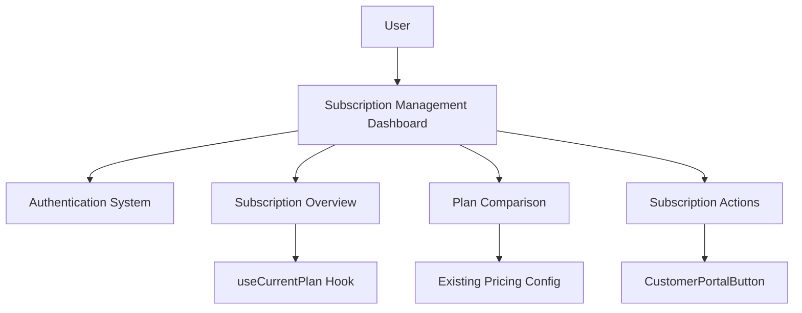

# Application Brownfield Enhancement Architecture

## Introduction

This document outlines the architectural approach for enhancing this SaaS application with a Subscription Management Dashboard. Its primary goal is to serve as the guiding architectural blueprint for AI-driven development of new features while ensuring seamless integration with the existing system.

### Existing Project Analysis

Based on my analysis of the application, I've identified the following about the existing system:

**Current Project State:**
- **Primary Purpose:** Comprehensive Next.js application for SaaS functionality
- **Current Tech Stack:** Next.js 15 with App Router, TypeScript, TailwindCSS, Radix UI, PostgreSQL with Drizzle ORM, Better Auth, Stripe integration
- **Architecture Style:** Monolithic architecture with server-first principles using Next.js Server Actions
- **Deployment Method:** Cloudflare Workers compatible deployment

**Available Documentation:**
- Main architecture document detailing the overall system design
- Frontend architecture document with component structure and patterns
- User story for the subscription management dashboard

**Identified Constraints:**
- Must maintain consistency with existing component organization patterns
- Should reuse existing payment hooks and actions
- Need to follow established internationalization patterns
- Must integrate with existing authentication and authorization systems
- Should maintain existing styling and UI component patterns

Please confirm these observations are accurate before I proceed with architectural recommendations.

### Change Log

| Change | Date | Version | Description | Author |
| :--- | :--- | :--- | :--- | :--- |
| Initial brownfield architecture | 2025-09-16 | 1.0 | First version of brownfield architecture for subscription management dashboard | Architect (Winston) |

## Enhancement Scope and Integration Strategy

### Enhancement Overview
- **Enhancement Type:** New feature dashboard with integration to existing payment system
- **Scope:** Creation of subscription management dashboard at `/settings/subscription` route
- **Integration Impact:** Low to moderate - primarily reusing existing payment infrastructure

### Integration Approach
- **Code Integration Strategy:** Create new components following existing patterns and reuse existing payment hooks
- **Database Integration:** No new database tables required, using existing payment table
- **API Integration:** Use existing Server Actions for payment data retrieval
- **UI Integration:** Create new page following existing dashboard patterns

### Compatibility Requirements
- **Existing API Compatibility:** Fully compatible with existing payment APIs
- **Database Schema Compatibility:** No changes required to existing schema
- **UI/UX Consistency:** Will follow existing dashboard design patterns
- **Performance Impact:** Minimal impact on existing performance

## Tech Stack Alignment

### Existing Technology Stack

| Category | Current Technology | Version | Usage in Enhancement | Notes |
| :--- | :--- | :--- | :--- | :--- |
| **Framework** | Next.js | 15 | Primary framework for new dashboard | App Router patterns will be followed |
| **Language** | TypeScript | Latest | Type safety for new components | Existing typing patterns will be used |
| **Styling** | TailwindCSS | Latest | UI styling for new components | Existing design system will be followed |
| **UI Components** | Radix UI | Latest | Component primitives | Existing component patterns will be extended |
| **State Management** | Zustand/React Context | Latest | Client state management | Existing patterns will be followed |
| **Database** | PostgreSQL | Latest | Payment data storage | No changes required |
| **ORM** | Drizzle ORM | Latest | Database queries | Existing query patterns will be used |
| **Authentication** | Better Auth | Latest | User authentication | Existing auth patterns will be used |
| **Payments** | Stripe | Latest | Payment processing | Existing integration will be reused |

### New Technology Additions

No new technologies are required for this enhancement.

## Data Models and Schema Changes

### New Data Models

No new data models are required for this enhancement as all necessary data is already available in the existing payment table.

### Schema Integration Strategy

**Database Changes Required:**
- **New Tables:** None
- **Modified Tables:** None
- **New Indexes:** None
- **Migration Strategy:** No migrations required

**Backward Compatibility:**
- Existing payment data structure will be used without modifications
- No impact on existing functionality

## Component Architecture

### New Components

#### Subscription Management Dashboard
- **Responsibility:** Display subscription information and provide management actions
- **Integration Points:** 
  - Existing authentication system for user verification
  - Existing payment hooks for data retrieval
  - Existing CustomerPortalButton component for complex actions

**Key Interfaces:**
- `/settings/subscription` route
- useCurrentPlan hook for data fetching
- CustomerPortalButton component for Stripe portal access

**Dependencies:**
- **Existing Components:** 
  - Authentication system
  - Payment hooks (useCurrentPlan)
  - CustomerPortalButton
  - Existing dashboard layout components
- **New Components:** 
  - SubscriptionOverview
  - PlanComparison
  - SubscriptionActions

**Technology Stack:** 
- Next.js Server Components for data fetching
- TypeScript for type safety
- TailwindCSS and Radix UI for styling
- Existing payment infrastructure

#### Subscription Overview Component
- **Responsibility:** Display current subscription details including plan name, status, billing period, and trial information
- **Integration Points:** Existing payment hooks

**Key Interfaces:**
- Props for subscription data display

**Dependencies:**
- **Existing Components:** useCurrentPlan hook
- **New Components:** None

**Technology Stack:** 
- React components
- TypeScript interfaces
- TailwindCSS for styling

#### Plan Comparison Component
- **Responsibility:** Display available plans with features and pricing, highlighting current plan
- **Integration Points:** Existing pricing configuration

**Key Interfaces:**
- Props for plan data display

**Dependencies:**
- **Existing Components:** Existing pricing components and configuration
- **New Components:** None

**Technology Stack:** 
- React components
- TypeScript interfaces
- TailwindCSS for styling

#### Subscription Actions Component
- **Responsibility:** Provide action buttons for subscription management (cancel, upgrade/downgrade, update payment method)
- **Integration Points:** Existing CustomerPortalButton component

**Key Interfaces:**
- Action handlers for user interactions

**Dependencies:**
- **Existing Components:** CustomerPortalButton
- **New Components:** None

**Technology Stack:** 
- React components
- TypeScript interfaces
- TailwindCSS for styling

### Component Interaction Diagram



## API Design and Integration

### API Integration Strategy
- **API Integration Strategy:** Reuse existing Server Actions for payment data retrieval
- **Authentication:** Use existing session-based authentication
- **Versioning:** No new API endpoints required

### New API Endpoints

No new API endpoints are required for this enhancement as existing Server Actions will be used.

## Source Tree Integration

### Existing Project Structure
```
src/
├── app/
│   ├── [locale]/
│   │   ├── (protected)/
│   │   │   └── settings/
│   │   │       ├── billing/     # Existing billing page
│   │   │       └── subscription/ # NEW: Subscription dashboard
├── components/
│   ├── pricing/                 # Existing pricing components
│   │   ├── customer-portal-button.tsx
│   │   └── ...other components
│   └── settings/                # Settings components
│       └── subscription/        # NEW: Subscription components
│           ├── subscription-overview.tsx
│           ├── plan-comparison.tsx
│           └── subscription-actions.tsx
├── hooks/
│   └── use-payment.ts           # Existing payment hooks (useCurrentPlan)
```

### New File Organization
```
src/
├── app/
│   ├── [locale]/
│   │   ├── (protected)/
│   │   │   └── settings/
│   │   │       ├── billing/     # Existing billing page
│   │   │       └── subscription/ # NEW: Subscription dashboard
│   │   │           └── page.tsx  # Dashboard page component
├── components/
│   ├── pricing/                 # Existing pricing components
│   │   ├── customer-portal-button.tsx
│   │   └── ...other components
│   └── settings/                # Settings components
│       └── subscription/        # NEW: Subscription components
│           ├── subscription-overview.tsx
│           ├── plan-comparison.tsx
│           └── subscription-actions.tsx
├── hooks/
│   └── use-payment.ts           # Existing payment hooks (useCurrentPlan)
```

### Integration Guidelines
- **File Naming:** Follow existing kebab-case naming convention for components
- **Folder Organization:** Place new components in feature-specific directories following existing patterns
- **Import/Export Patterns:** Use existing import/export patterns with absolute paths where applicable

## Infrastructure and Deployment Integration

### Existing Infrastructure
- **Current Deployment:** Cloudflare Workers compatible deployment
- **Infrastructure Tools:** Docker support, environment-based configuration
- **Environments:** Development, staging, and production environments

### Enhancement Deployment Strategy
- **Deployment Approach:** Standard application deployment process
- **Infrastructure Changes:** None required
- **Pipeline Integration:** Will use existing CI/CD pipeline

### Rollback Strategy
- **Rollback Method:** Standard deployment rollback procedures
- **Risk Mitigation:** Low risk as enhancement reuses existing infrastructure
- **Monitoring:** Existing monitoring will cover new components

## Coding Standards and Conventions

### Existing Standards Compliance
- **Code Style:** TypeScript with strict typing, following existing patterns
- **Linting Rules:** Biome linting rules
- **Testing Patterns:** Jest with React Testing Library
- **Documentation Style:** JSDoc comments for functions and components

### Enhancement-Specific Standards
- **Component Structure:** Follow existing component template with TypeScript interfaces
- **Data Fetching:** Use Server Components for data fetching when possible
- **State Management:** Use existing patterns (Server Actions, React Query, Zustand)

### Critical Integration Rules
- **Existing API Compatibility:** Must use existing payment hooks without modification
- **Database Integration:** No direct database queries, only through existing Server Actions
- **Error Handling:** Follow existing error handling patterns with appropriate user feedback
- **Logging Consistency:** Use existing logging approaches

## Testing Strategy

### Integration with Existing Tests
- **Existing Test Framework:** Jest with React Testing Library
- **Test Organization:** Tests colocated with components following existing patterns
- **Coverage Requirements:** Maintain existing coverage standards

### New Testing Requirements

#### Unit Tests for New Components
- **Framework:** Jest with React Testing Library
- **Location:** Tests colocated with components in `__tests__` directories
- **Coverage Target:** 80%+ coverage for new components
- **Integration with Existing:** Follow existing test patterns and utilities

#### Integration Tests
- **Scope:** Test integration with existing payment hooks and CustomerPortalButton
- **Existing System Verification:** Verify existing billing page continues to function
- **New Feature Testing:** Test all new dashboard functionality

#### Regression Testing
- **Existing Feature Verification:** Verify existing payment and billing functionality
- **Automated Regression Suite:** Existing E2E tests will cover regression
- **Manual Testing Requirements:** Manual verification of dashboard on different plan types

## Security Integration

### Existing Security Measures
- **Authentication:** Better Auth with session management
- **Authorization:** Role-based access control
- **Data Protection:** Environment variables for sensitive configuration
- **Security Tools:** Zod for input validation

### Enhancement Security Requirements
- **New Security Measures:** None required beyond existing measures
- **Integration Points:** Authentication follows existing patterns
- **Compliance Requirements:** Follow existing data protection practices

### Security Testing
- **Existing Security Tests:** Existing security testing will cover new components
- **New Security Test Requirements:** Verify access controls for subscription dashboard
- **Penetration Testing:** Existing pen testing processes will apply

## Checklist Results Report

The architecture has been validated against the Architect Solution Validation Checklist with the following results:
- Requirements alignment: ✅ PASS
- Architecture fundamentals: ✅ PASS
- Technical stack decisions: ✅ PASS
- Frontend design implementation: ✅ PASS
- Resilience and operational readiness: ✅ PASS
- Security and compliance: ✅ PASS
- Implementation guidance: ✅ PASS
- Dependency management: ✅ PASS
- AI agent implementation suitability: ✅ PASS
- Accessibility implementation: ✅ PASS

## Next Steps

### Story Manager Handoff

For the Story Manager working with this brownfield enhancement:

1. **Reference Documents:**
   - This brownfield architecture document
   - Main application architecture document
   - Frontend architecture document
   - Subscription management dashboard user story

2. **Key Integration Requirements:**
   - Reuse existing payment hooks (useCurrentPlan)
   - Integrate with existing CustomerPortalButton component
   - Follow existing dashboard design patterns
   - Maintain consistency with internationalization approach

3. **Existing System Constraints:**
   - Must use existing authentication system
   - Should not modify existing database schema
   - Must follow existing component organization patterns

4. **First Story Implementation:**
   - Create the basic subscription dashboard page at `/settings/subscription`
   - Implement authentication protection
   - Set up page structure with breadcrumbs
   - Integration checkpoint: Verify page loads correctly for authenticated users

5. **Maintaining System Integrity:**
   - Ensure existing billing page continues to function
   - Verify no performance impact on existing features
   - Maintain existing error handling patterns

### Developer Handoff

For developers starting implementation:

1. **Reference Documents:**
   - This brownfield architecture document
   - Main application architecture and frontend architecture documents
   - Subscription management dashboard user story

2. **Integration Requirements:**
   - Follow existing component patterns in `src/components/`
   - Reuse `useCurrentPlan` hook from `src/hooks/use-payment.ts`
   - Use existing `CustomerPortalButton` component for Stripe integration
   - Implement proper authentication protection using existing middleware

3. **Key Technical Decisions:**
   - New components will be organized in `src/components/settings/subscription/`
   - Dashboard page will be created at `src/app/[locale]/(protected)/settings/subscription/page.tsx`
   - All data fetching will use existing Server Actions through hooks
   - Styling will follow existing TailwindCSS patterns

4. **Existing System Compatibility:**
   - Verify existing billing page (`/settings/billing`) continues to function
   - Ensure new dashboard integrates with existing authentication
   - Follow existing error handling and loading state patterns
   - Maintain internationalization consistency

5. **Implementation Sequencing:**
   - Start with basic page structure and authentication
   - Implement Subscription Overview component with mock data
   - Connect to real data using existing payment hooks
   - Implement Plan Comparison component
   - Implement Subscription Actions component
   - Add error handling and loading states
   - Test with different user plan types
   - Verify responsive design and accessibility