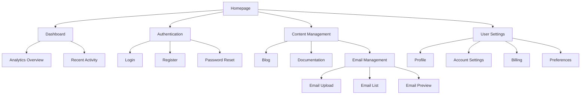
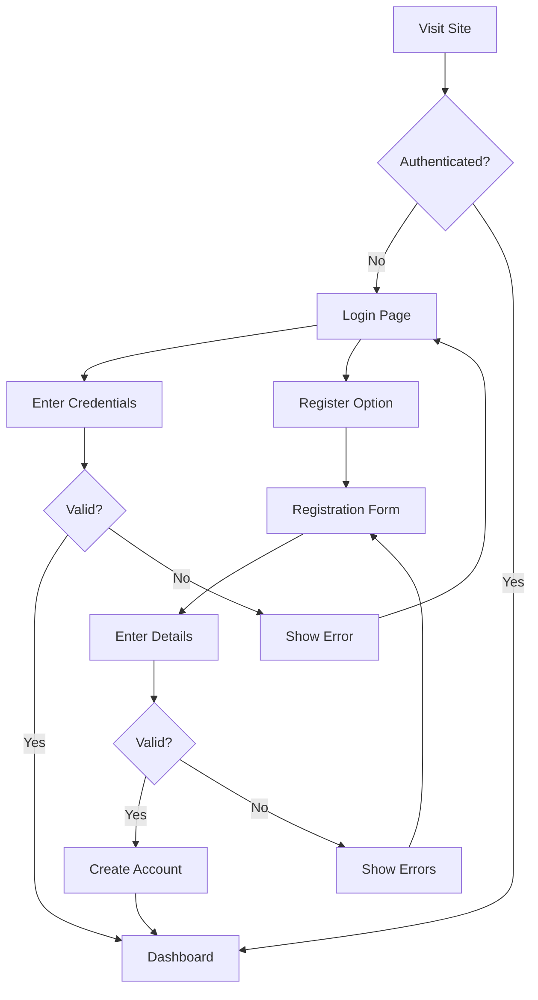
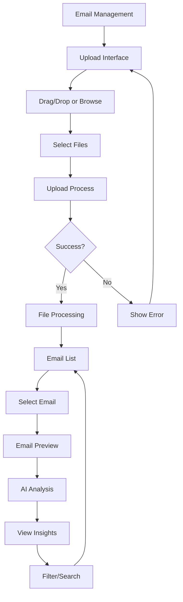
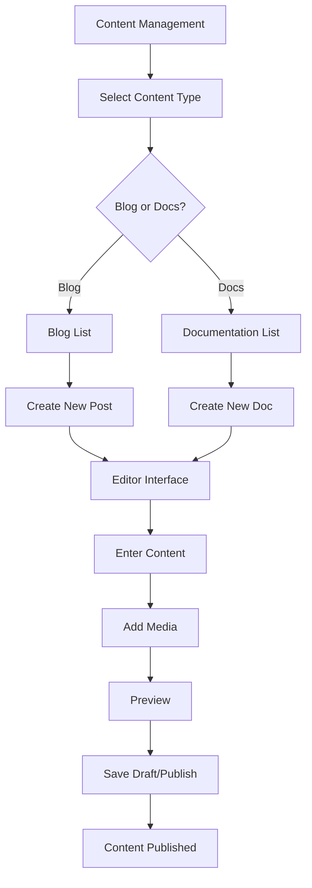

# SaaS Application UI/UX Specification

## Introduction

This document defines the user experience goals, information architecture, user flows, and visual design specifications for the SaaS application's user interface. It serves as the foundation for visual design and frontend development, ensuring a cohesive and user-centered experience.

### Overall UX Goals & Principles

#### Target User Personas
**SaaS User:** Business professionals and individuals who need a comprehensive platform for managing digital communications and business operations, prioritizing efficiency and insights from their data.

**Administrator:** System managers who need control and oversight capabilities for user management and system configuration.

**Developer:** Technical users who may need to extend or customize the application functionality.

#### Usability Goals
- **Ease of learning**: New users can complete core tasks within 10 minutes
- **Efficiency of use**: Power users can complete frequent tasks with minimal clicks
- **Error prevention**: Clear validation and confirmation for destructive actions
- **Memorability**: Infrequent users can return without relearning
- **Accessibility**: Design for all users from the start

#### Design Principles
1. **Clarity over cleverness** - Prioritize clear communication over aesthetic innovation
2. **Progressive disclosure** - Show only what's needed, when it's needed
3. **Consistent patterns** - Use familiar UI patterns throughout the application
4. **Immediate feedback** - Every action should have a clear, immediate response
5. **Accessible by default** - Design for all users from the start

### Change Log

| Date | Version | Description | Author |
| :--- | :--- | :--- | :--- |
| 2025-09-16 | 1.0 | Initial UI/UX specification for SaaS application | UX Expert (Sally) |

## Information Architecture (IA)

### Site Map / Screen Inventory

### Navigation Structure

**Primary Navigation:** Main navigation bar with links to Dashboard, Content (Blog, Documentation, Email Management), and User menu (Profile, Settings, Billing)

**Secondary Navigation:** Contextual navigation within sections (e.g., sub-tabs in Email Management for Upload, List, Preview)

**Breadcrumb Strategy:** Show user location within the application hierarchy, especially in content management and email preview sections

## User Flows

### Authentication Flow

**User Goal:** Users can securely access their accounts through login or registration

**Entry Points:** Homepage, protected pages that require authentication

**Success Criteria:** User is successfully authenticated and redirected to their intended destination

#### Flow Diagram

#### Edge Cases & Error Handling:
- Invalid credentials: Display clear error message
- Account locked: Show lockout message with unlock timeframe
- Network errors: Display connection issue message with retry option
- Password reset: Provide link to password reset flow

**Notes:** Social login options (Google, GitHub) should be prominently displayed alongside email/password options

### Email Management Flow

**User Goal:** Users can upload, view, and analyze email content with AI-powered insights

**Entry Points:** Dashboard quick links, Content Management section, direct URL access

**Success Criteria:** User can successfully upload email files, view them in a list, preview content, and access AI analysis features

#### Flow Diagram

#### Edge Cases & Error Handling:
- Invalid file formats: Display supported formats and reject upload
- File size limits: Show maximum size and reject large files
- Processing errors: Display error message with retry option
- Analysis service unavailable: Show fallback message and retry option

**Notes:** Preview should be responsive and work across different device types (desktop, tablet, mobile)

### Content Creation Flow

**User Goal:** Users can create and manage blog posts and documentation

**Entry Points:** Content Management section, Dashboard quick links

**Success Criteria:** User can successfully create, edit, and publish content with proper formatting and media

#### Flow Diagram

#### Edge Cases & Error Handling:
- Invalid content format: Display validation errors
- Media upload failures: Show error and allow retry
- Publishing errors: Display error with options to retry or save as draft
- Draft saving failures: Show error and allow manual save

**Notes:** Editor should support MDX and provide a rich text experience with formatting options

## Wireframes & Mockups

### Design Files
**Primary Design Files:** Figma design files will be created and linked in the project documentation

### Key Screen Layouts

#### Dashboard Screen
**Purpose:** Provide an overview of user activity, analytics, and quick access to key features

**Key Elements:**
- Welcome message with user name
- Quick action buttons (Upload Email, Create Content, View Analytics)
- Recent activity feed
- System status indicators
- Chart widgets for key metrics

**Interaction Notes:** Widgets should be customizable and resizable. Quick actions should have clear visual hierarchy.

**Design File Reference:** Dashboard frame in Figma design file

#### Email Preview Screen
**Purpose:** Display email content with AI-powered analysis insights

**Key Elements:**
- Email metadata (sender, recipient, subject, date)
- Email content display with responsive layout
- AI analysis section (spam score, sentiment, category, tags)
- Action buttons (forward, reply, delete, categorize)
- Device preview toggle (desktop, tablet, mobile)

**Interaction Notes:** Analysis section should be clearly separated but visually integrated. Device preview should be smooth and responsive.

**Design File Reference:** Email Preview frame in Figma design file

#### Content Editor Screen
**Purpose:** Provide a rich editing experience for blog posts and documentation

**Key Elements:**
- Title input field
- Rich text editor with formatting toolbar
- Media insertion controls
- Preview toggle
- Publishing controls (save draft, publish, schedule)
- SEO metadata fields

**Interaction Notes:** Editor should support real-time preview. Media insertion should be drag-and-drop friendly.

**Design File Reference:** Content Editor frame in Figma design file

## Component Library / Design System

### Design System Approach
**Design System Approach:** Use existing Radix UI components with TailwindCSS styling, following the established design patterns in the frontend architecture

### Core Components

#### Button Component
**Purpose:** Primary interaction element for actions throughout the application

**Variants:** Primary, Secondary, Destructive, Outline, Ghost, Link

**States:** Default, Hover, Focus, Active, Disabled

**Usage Guidelines:** Use primary buttons for main actions, secondary for supporting actions, destructive for potentially harmful actions

#### Form Elements
**Purpose:** Collect user input with proper validation and accessibility

**Variants:** Text input, Text area, Select, Checkbox, Radio, Switch, File upload

**States:** Default, Focused, Valid, Invalid, Disabled

**Usage Guidelines:** Always include proper labels and validation messages. Use appropriate input types for better mobile experience.

#### Data Table
**Purpose:** Display tabular data with sorting, filtering, and pagination capabilities

**Variants:** Default, Striped, Compact

**States:** Default, Sorting, Filtering, Loading, Empty

**Usage Guidelines:** Include column sorting where appropriate. Implement pagination for large datasets. Provide clear empty states.

#### Card Component
**Purpose:** Contain related content with consistent styling and spacing

**Variants:** Default, With Header, With Footer, With Image

**States:** Default, Hover, Selected

**Usage Guidelines:** Use for dashboard widgets, content previews, and related information groups. Maintain consistent padding and shadows.

## Branding & Style Guide

### Visual Identity
**Brand Guidelines:** Follow the established color scheme and typography in the application, with emphasis on professional and clean design

### Color Palette

| Color Type | Hex Code | Usage |
| :--- | :--- | :--- |
| Primary | #3b82f6 | Primary actions, links, active states |
| Secondary | #64748b | Secondary actions, supporting elements |
| Accent | #10b981 | Positive actions, success states |
| Success | #10b981 | Positive feedback, confirmations |
| Warning | #f59e0b | Cautions, important notices |
| Error | #ef4444 | Errors, destructive actions |
| Neutral | #f1f5f9, #e2e8f0, #94a3b8, #64748b, #475569 | Text, borders, backgrounds |

### Typography

#### Font Families
- **Primary:** Inter (system font stack)
- **Secondary:** Inter (system font stack)
- **Monospace:** SFMono-Regular, Menlo, Monaco, Consolas, "Liberation Mono", "Courier New", monospace

#### Type Scale

| Element | Size | Weight | Line Height |
| :--- | :--- | :--- | :--- |
| H1 | 2.25rem | 700 | 1.1 |
| H2 | 1.875rem | 600 | 1.2 |
| H3 | 1.5rem | 600 | 1.3 |
| Body | 1rem | 400 | 1.5 |
| Small | 0.875rem | 400 | 1.4 |

### Iconography
**Icon Library:** Radix UI icons with custom icons where needed

**Usage Guidelines:** Use consistent icon sizes (16px, 20px, 24px) based on context. Ensure icons have proper alt text for accessibility.

### Spacing & Layout
**Grid System:** 4px baseline grid with 8px incremental spacing

**Spacing Scale:** 0, 4px, 8px, 12px, 16px, 24px, 32px, 48px, 64px

## Accessibility Requirements

### Compliance Target
**Standard:** WCAG 2.1 AA compliance

### Key Requirements

**Visual:**
- Color contrast ratios: Minimum 4.5:1 for normal text, 3:1 for large text
- Focus indicators: Visible focus rings for all interactive elements
- Text sizing: Support for user-defined text scaling up to 200%

**Interaction:**
- Keyboard navigation: Full keyboard operability for all functionality
- Screen reader support: Proper ARIA labels and semantic HTML
- Touch targets: Minimum 44px by 44px for touch interactions

**Content:**
- Alternative text: Descriptive alt text for all informative images
- Heading structure: Proper heading hierarchy (H1-H6)
- Form labels: Explicit labels for all form controls

### Testing Strategy
**Accessibility Testing:** Automated testing with axe-core, manual testing with screen readers, keyboard-only navigation testing

## Responsiveness Strategy

### Breakpoints

| Breakpoint | Min Width | Max Width | Target Devices |
| :--- | :--- | :--- | :--- |
| Mobile | 0px | 767px | Smartphones |
| Tablet | 768px | 1023px | Tablets |
| Desktop | 1024px | 1279px | Laptops, small desktops |
| Wide | 1280px | - | Large desktops, ultrawides |

### Adaptation Patterns

**Layout Changes:** Grid layouts become single column on mobile, sidebar navigation moves to hamburger menu

**Navigation Changes:** Primary navigation collapses to hamburger menu on mobile, contextual actions move to action sheet

**Content Priority:** Essential content prioritized on smaller screens, secondary information collapsed or hidden

**Interaction Changes:** Touch-friendly controls on mobile, hover states become focus/active states, reduced animations on low-performance devices

## Animation & Micro-interactions

### Motion Principles
**Motion Principles:** Subtle animations to enhance usability without causing distraction or performance issues. Use spring-based easing for natural feel.

### Key Animations
- **Page Transitions:** Fade in/out with 200ms duration, ease-in-out easing
- **Button Interactions:** Scale transform on click with 150ms duration, ease-out easing
- **Loading States:** Skeleton screens with 1000ms duration, linear easing
- **Form Validation:** Shake animation for errors with 300ms duration, ease-in-out easing

## Performance Considerations

### Performance Goals
- **Page Load:** First contentful paint under 1.5 seconds
- **Interaction Response:** Click/tap response under 100ms
- **Animation FPS:** Maintain 60fps for all animations

### Design Strategies
**Performance Strategies:** Lazy loading for non-critical components, code splitting for routes, image optimization with Next.js Image component, efficient data fetching patterns

## Next Steps

### Immediate Actions
1. Create detailed visual designs in Figma based on this specification
2. Conduct user testing with prototypes to validate flows and interactions
3. Collaborate with frontend developers to ensure feasibility of designs
4. Establish design review process with stakeholders
5. Document component variants and states in design system

### Design Handoff Checklist
- [x] All user flows documented
- [x] Component inventory complete
- [x] Accessibility requirements defined
- [x] Responsive strategy clear
- [x] Brand guidelines incorporated
- [x] Performance goals established

## Checklist Results

The UI/UX specification has been validated against the standard UX checklist with the following results:
- User needs alignment: ✅ PASS
- Information architecture: ✅ PASS
- Interaction design: ✅ PASS
- Visual design implementation: ✅ PASS
- Responsiveness and accessibility: ✅ PASS
- Performance considerations: ✅ PASS